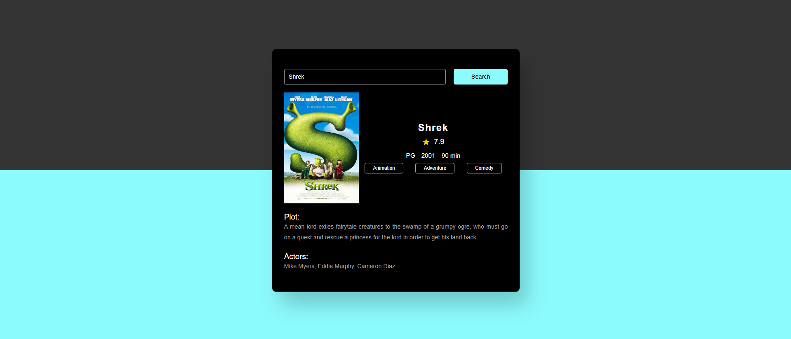
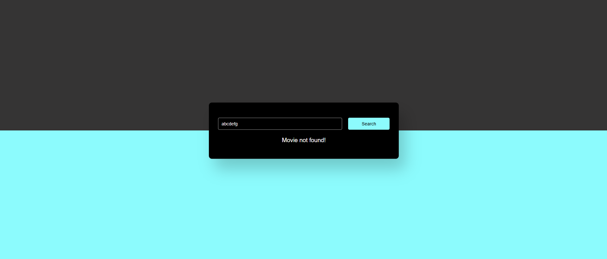
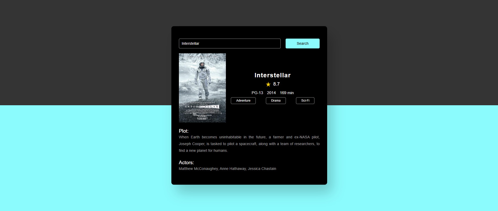

# movie-guide-app
A Movie Guide web app built with HTML, CSS, JavaScript and the OMDb API. It allows users to search any movie to get details like plot, cast, ratings and more, with a clean and responsive interface.

## Features
- **Search Movies** - Enter any movie title to view details
- **Movie Details** - Displays title, year, genre, plot, ratings and cast
- **Responsive UI** - Clean and responsive UI
- **Error Handling** - 
      - Empty search-> "Please enter a movie name"
      - Invalid movie-> "Movie Not Found!"

## Tech Stack
- **Frontend**: HTML, CSS, JavaScript
- **API**: [OMDb API](http://www.omdbapi.com/)
  
## Screenshots

